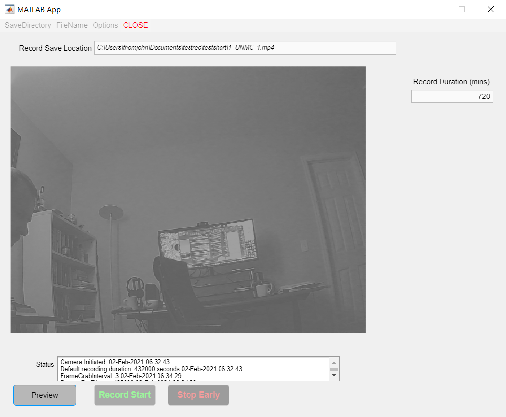
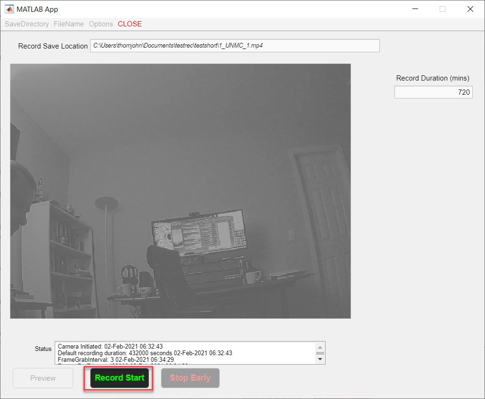

# UH3-RestoreSleepPD Study

#### Matlab app to record video during sleep

<!-- PROJECT LOGO -->
<br />

<p align="center">
  <a href="https://github.com/UH3-RestoreSleepPD/SleepVideoRecord">
    
  </a>

  <h3 align="center">Sleep Video Recording Application</h3>

  <p align="center">
    Matlab GUI application to record during UH3 study
    <br />
    <a href="https://github.com/UH3-RestoreSleepPD/SleepVideoRecord"><strong>Explore the docs »</strong></a>
    <br />
    <br />
      <a href="https://github.com/UH3-RestoreSleepPD/SleepVideoRecord/tree/main/SleepVideoGUI_Code/Record_IR_Video_App_v02142021.mlapp"><strong>Latest Version »</strong></a>
    <br />
    <br />
    ·
    <a href="https://github.com/UH3-RestoreSleepPD/SleepVideoRecord/issues">Report Bug</a>
    ·
    <a href="https://github.com/UH3-RestoreSleepPD/SleepVideoRecord/issues">Request Feature</a>
  </p>

</p>

------

## How to Use:

##### 1. Enter name of GUI application in Command Window

```matlab
>> Record_IR_Video_App_v02012021
```

##### 2. Upon opening GUI you will be prompted to enter the Save Location


##### 3: Use directory window to navigate to save location


##### 4. After setting save location you will be promoted to enter a File name


##### 5. You will be prompted to enter File information

- Subject number 
- Institution
- Night of sleep (number)


##### 6. Save location and File name will be indicated in the 'Record Save Location' text field box - Now Preview button available


##### 7. Use the Preview Button to check the Camera view



##### 8. Unclick the Preview to permit Recording

##### 9. Before activating the 'Record' function, check the recording duration [in minutes]


##### 10. The Start Recording will be available



##### 11. During recording, the display will indicate the current hour block recorded


##### 12. If the RECORDING completes the set time then the CLOSE request will appear


##### 13. To start a new recording, restart the GUI by pressing the CLOSE button


##### 14. To stop the recording before the set time, press the 'Stop Early' button


##### 15. Early stop will execute the CLOSE request


Trouble-shooting:

| Issue                       | Code output                                                  | Solution                            |
| --------------------------- | ------------------------------------------------------------ | ----------------------------------- |
| HD USB Camera not available |                          | Restart Matlab and reconnect camera |
|                             |                                                              |                                     |
|                             |                                                              |                                     |
|                             |                                                              |                                     |
|                             |                                                              |                                     |

